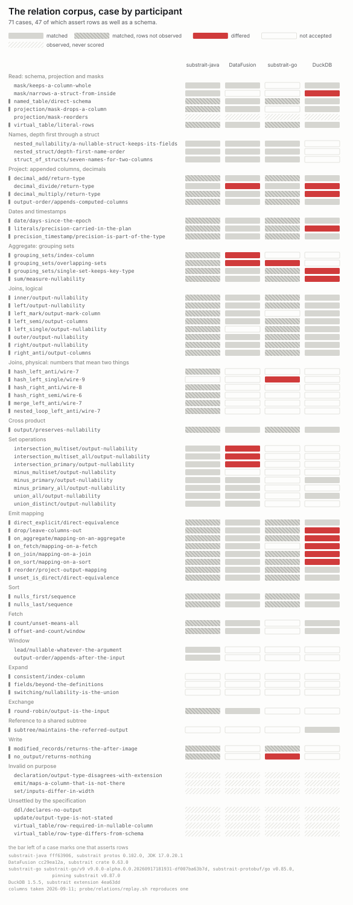

# Substrait conformance cases

Two corpora of executable cases against the Substrait specification at v0.102.0. Every expectation
here is written from the sentence of the specification it names, not captured from an
implementation, and every answer beside it is retaken by one command.

| | | |
| --- | --- | --- |
| [`derived-schema/`](derived-schema) | 98 generated plans, where the type a plan declares and the type a consumer derives can disagree without either side raising it | substrait-java, substrait-python, substrait-go, substrait-validator, Isthmus/Calcite, DataFusion, DuckDB, Spark, Acero, Gluten |
| [`tests/relations/`](tests/relations) | 71 hand-written cases pinning what the relation documentation says a relation outputs, schema and rows alike | substrait-java, substrait-go, DuckDB, DataFusion |

[The matrix as a page](https://alexandrefimov.github.io/substrait-conformance-cases/) puts the
answer and the expectation beside each cell.

## If your project is here

Twenty of the twenty-four reasons behind a divergence link an issue or a PR in the project it is
about: substrait, substrait-java, substrait-go, substrait-python, substrait-validator, DataFusion,
DuckDB's extension, Arrow. Yours may be among them already.

- [`results/DIFFS.md`](results/DIFFS.md) — your cases out of the 98, each with the expectation, the
  answer your build gave, and what came of it.
- The relation corpus is [on the page](https://alexandrefimov.github.io/substrait-conformance-cases/#relations);
  its reasons are [`results/relations/differed.json`](results/relations/differed.json).
- `bash probe/replay_column.sh <NAME>` and `bash probe/relations/replay.sh <NAME>` rebuild one
  implementation from nothing at the version it was measured at, and require the saved answers back.

An expectation can be wrong, and a wrong one is reported as a divergence against an implementation
that was right. If one does not follow from the sentence it names, that is worth an issue here.

## What the corpus says

Take `decimal_divide`, `dec(10,2)` over `dec(5,1)`, where
`functions_arithmetic_decimal.yaml` gives `dec(21,8)`:

    substrait-java, substrait-go, substrait-python, validator, Isthmus, Gluten   dec(21,8)
    Spark        dec(17,8)
    DataFusion   dec(15,6)
    DuckDB       fp64
    Acero        dec(16,7)

The columns were taken 2026-09-09 against the versions in `probe/versions.env`; the weekly `drift`
run records what has moved since, in `results/DRIFT.txt`. They answer the 93 cases that carry an
expectation. The nine in the table are consumer paths rather than engines — the Java core, Isthmus
and Spark all go through substrait-java, DuckDB through its substrait extension — and Gluten, the
tenth, runs over the virtual-table variant in a cluster.

<picture>
  <source media="(prefers-color-scheme: dark)" srcset="docs/matrix-dark.svg">
  
</picture>

Matched in grey, differed in red, a plan the implementation does not accept as an outline, a limit
of its type system hatched.

| | matched | differed | unsupported |
| --- | ---: | ---: | ---: |
| substrait-java | 88 | 2 | 3 |
| substrait-python | 68 | 24 | 1 |
| substrait-go | 59 | 4 | 30 |
| substrait-validator | 47 | 28 | 18 |
| Isthmus/Calcite | 51 | 5 | 37 |
| DataFusion | 54 | 9 | 30 |
| DuckDB | 34 | 20 | 39 |
| Spark | 29 | 6 | 58 |
| Acero | 4 | 15 | 74 |

**The first row is calibration, not a result.** Most plans are built with substrait-java builders,
by the person who also wrote the generators and the expectations, so its 88 matches say that two
encodings of a spec rule agree. [METHOD.md](METHOD.md) has the experiment that swaps a declared
`output_type` for a false one and finds Java's answer following it, and
[the two `expand` cells](METHOD.md#the-two-expand-cases) where even this row differs.

*Differed* means the answer disagrees
with this repository's reading of the spec, which is not the same as a defect:
`differed.json` carries a reason written by hand for all 113 of them, 17 marked as something other
than a divergence, and `probe/check_differed.py` tests every reason against the saved column. A
column is also compared only as far as its own type system reaches — DuckDB's logical types carry no
nullability, nor do Gluten's — and one that stops short says so in the head of its
`results/<NAME>.txt`.

Which relations those 98 plans reach at all is counted in [METHOD.md](METHOD.md#what-the-corpus-covers), from the plans themselves.

## What would help

- **A second reading of the expectations, by someone with no stake in them.** They have been read
  once, from inside this repository: one contradicted the specification and was fixed, and
  [sixteen rest on a step the specification never states](https://github.com/alexandrefimov/substrait-conformance-cases/issues/8),
  thirteen of them joins. An answer on those sixteen is worth more than a fresh pass over the rest,
  and a wrong expectation is reported as a divergence against an implementation that was right.
- **From the spec, one answer.** When a virtual table's rows disagree with the schema it declares —
  an i8 literal in an i32 column, a null in a required one — which wins? Four cases here go unscored
  pending one; the fifth case without an expectation is a plan invalid on purpose, where a refusal
  is the right answer.

## Running it

    bash probe/selfcheck.sh
    bash probe/replay_column.sh PYTHON|GO|DUCKDB|ACERO|VALIDATOR|JAVA|ISTHMUS|SPARK|DATAFUSION
    bash probe/relations/replay.sh DUCKDB|GO|JAVA|DATAFUSION
    python3 probe/relations/retake.sh

The first recomputes every number on this page from the committed files; it needs python3 and
nothing else. The rest rebuild one implementation at its pinned version and require its saved
answers back. [`probe/README.md`](probe/README.md) has the prerequisites and what fails a run,
[`probe/relations/README.md`](probe/relations/README.md) the same for the relation corpus.

## What is here

| | |
| --- | --- |
| `derived-schema/` | the 98 plans, protobuf-JSON and binary, beside a `manifest.json` saying per case what it pins, the schema expected of it and the spec rule that expectation comes from. Read that rather than the plan |
| `derived-schema-virtual-tables/` | the same cases carrying their own rows |
| `results/<NAME>.txt` | one column per implementation; `probe/matrix.py`, `probe/diffs.py` and `probe/heatmap.py` draw `results/MATRIX.txt`, `results/DIFFS.md` and the pictures out of them |
| `expected.json` | the expectations, written by `probe/expected.py` |
| `differed.json` | a reason per differing cell |

Everything keys on a case's file name, and nothing generated is edited by hand.

Whether cases like these belong in the spec repository is under discussion in
[substrait#1164](https://github.com/substrait-io/substrait/issues/1164); this repository is where
they live meanwhile. The function test cases the spec ships check what a scalar function returns;
these compare schemas across relations. Adding one costs a JDK and a substrait-java checkout — the
generators build the plans with that library's builders, and [`gen/README.md`](gen/README.md) says
how. [METHOD.md](METHOD.md) is the method and what a match proves; [FINDINGS.md](FINDINGS.md) the
way from a report back to the cases that reproduce it.

## The relation corpus

<picture>
  <source media="(prefers-color-scheme: dark)" srcset="docs/relations-dark.svg">
  
</picture>

One story per column. substrait-java answers 58 of the 63 scored cases and refuses 5. substrait-go
refuses 28, eight of them the set operations, whose inputs it requires to agree on a nullability
these cases deliberately vary. DuckDB and DataFusion execute, so they are the two measured against
the rows that 47 of the cases assert. DuckDB's 11 divergences all show in the schema, five of them
in the rows as well, and so do DataFusion's 6, two of them in the rows: so far the rows have
confirmed an answer rather than caught one. Both reach the rows of 31 cases and return the same rows
on 26. The other five are the emit cases, where DataFusion returns the rows the case asserts and
DuckDB does not. The hatched cells are substrait-java and substrait-go agreeing about a schema and
never seeing the rows. Eight cases carry no expectation on purpose and are never scored.

`results/relations/` holds one column per participant, and `bash probe/relations/replay.sh <NAME>`
rebuilds one participant from nothing at its pinned version.
[`probe/relations/README.md`](probe/relations/README.md) is how the measurement works and how to add
a fifth.
