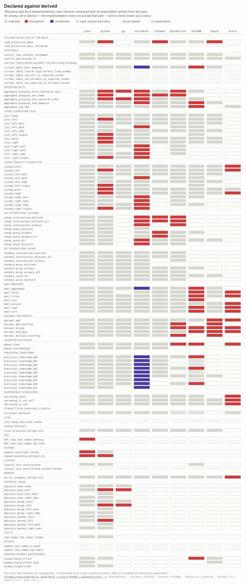

# Substrait conformance cases: declared type against derived type

**[Every case against every implementation](https://alexandrefimov.github.io/substrait-conformance-cases/)** —
the matrix as a page, with the expectation and the answer beside each cell.

A plan declares types and a consumer derives them again — or reuses what the plan declared. When
the two disagree, nothing in the format notices. The main comparison corpus contains 78 plans built
to make such disagreements visible, an expected schema for 73 of them, and probes that put the corpus
through ten implementations.

[Focused diagnostics](probe/README.md#focused-schema-diagnostics) also include
minimal consumer cases with controls and checks of producer output. These can be
run separately and are not counted in the saved 78-plan matrix.

The expectations are the part worth being suspicious of, so this is how they are made. Each one is
written by hand from the spec — the derivation tables, the decimal formulas, the relation rules — in
`probe/expected.py`, which reads no plan and no consumer output. Nothing here asks an implementation
what the answer should be. The spec repo already ships function test cases, which check what a
scalar function returns; these cases compare schemas across relations.

Take `decimal_divide`, which divides `dec(10,2)` by `dec(5,1)`. The formula in
`functions_arithmetic_decimal.yaml` gives `dec(21,8)`, which six consumer paths report:

    substrait-java, substrait-go, substrait-python, validator, Isthmus, Gluten   dec(21,8)
    Spark        dec(17,8)
    DataFusion   dec(15,6)
    DuckDB       fp64
    Acero        dec(16,7)

(Types are shown in the corpus's own notation; `results/<NAME>.txt` keeps each implementation's spelling.)

## What would help

Three things, in the order they are worth someone's time:

- **A reading of `probe/expected.py` against the spec.** It is 73 expectations written by hand from
  the spec text; nobody outside this repository has checked them, and an expectation that is wrong
  turns into a divergence reported against an implementation that was right.
- **For a participant's maintainer: the cases that differ for you.** `differed.json` names them per
  participant with a reason each — 28 for the validator, 18 for DuckDB, 17 for substrait-python,
  16 for Acero — as plans you can take into your own tests without any of this harness.
- **One answer from the spec.** When a virtual table's rows disagree with the schema it declares —
  an i8 literal in an i32 column, a null in a required one — which wins? Four cases here go unscored
  pending clarification of exact type equality versus compatibility. We have not found an explicit
  rule that resolves this question.

Whether cases like these belong in the spec repository is the question under discussion in
[substrait#1164](https://github.com/substrait-io/substrait/issues/1164). This repository is where
they live meanwhile, kept reproducible: a case is added by adding a generator to `gen/`, a column is
retaken by `probe/reverify.sh`, and if a number on this page is wrong, that is a bug here and worth
an issue.

## What the corpus says

The columns saved here were taken 2026-09-07, 2026-09-08 against the versions in `probe/versions.env`, which
each column's own first line names again. They answer the 73 cases that carry an expectation:

<picture>
  <source media="(prefers-color-scheme: dark)" srcset="docs/matrix-dark.svg">
  
</picture>

Silence is drawn as an outline rather than as a colour, so a column of refusals cannot be read as a
column of wrong answers, and a limit of a type system is hatched rather than red.
[The same matrix as a page](https://alexandrefimov.github.io/substrait-conformance-cases/) puts the
expectation and the answer beside each cell.

| | matched | differed | unsupported |
| --- | ---: | ---: | ---: |
| substrait-java | 73 | 0 | 0 |
| substrait-python | 56 | 17 | 0 |
| substrait-go | 55 | 2 | 16 |
| substrait-validator | 45 | 28 | 0 |
| Isthmus/Calcite | 49 | 5 | 19 |
| DataFusion | 52 | 9 | 12 |
| DuckDB | 33 | 18 | 22 |
| Spark | 26 | 6 | 41 |
| Acero | 3 | 15 | 55 |

**The first row is calibration, not a result.** Most plans are built with substrait-java builders,
and the same person wrote the generators, the expectations and part of substrait-java. Its 73
matches say the two encodings of a spec rule agree. They do not say the consumer derived anything:
swap a declared `output_type` for a false one and Java's answer follows it on ten of the 22 scored
cases that carry one, as do substrait-python and the validator. [METHOD.md](METHOD.md) has that
experiment, its tallies and what it cannot reach.

These are nine consumer paths rather than nine engines — the Java core, Isthmus and Spark paths
share substrait-java, Isthmus adding Calcite conversion and Spark its Catalyst one. Gluten has a
separate cluster run over the virtual-table variant and is outside this comparison. *Unsupported*
means the probe produced no comparable schema: rejections, errors and crashes. Read *differed*
against *matched + differed*; the unsupported count records the rest of the cases.

*Differed* means the answer disagrees with this repository's reading of the spec, and not every such
cell is a defect. `differed.json` gives all 100 of them a reason and marks 17 as something other than
a divergence: six are limits of a type system, eleven a type the validator never resolved. Each
reason carries a property that `probe/check_differed.py` tests against the saved column or the case
inputs, so a reason cannot quietly describe a cell it does not fit; the cause it states still needs
a human reading. Naming is not counted as disagreement: where an engine spells types its own way,
`probe/check_expected.py` maps the vocabularies onto each other, so `Decimal128(38,10)` and
`decimal<38,10>` are the same answer. To reproduce one row of the table and see the cases behind it:
`probe/check_expected.py results/<NAME>.txt <format>`.

A column also has a reach, and a number read past it says nothing. The first line of each
`results/<NAME>.txt` says how far that one goes:

| | how far the column goes |
| --- | --- |
| DuckDB | carries no nullability in its logical types, so only types, arity and column order are compared. Comparing nullability would record the boundary of its type system as a divergence |
| DataFusion, DuckDB | have no string type with a length. Neither can represent `varchar<10>` or `fixedchar<5>`, which is why `stringlen_declared` differs there — not a defect |
| Acero, Spark | do carry nullability and are compared on it |
| Gluten | carries no nullability either, and repeats a function's declared type instead of deriving it |
| substrait-validator | the pinned revision retains declared function return types; schema output must be read alongside diagnostics. The mutation checks final output schemas, not every expression's type |

## What is here

The corpus is `derived-schema/` — 78 plans as protobuf-JSON and as binary protobuf, with a
`manifest.json` describing every one — plus `derived-schema-virtual-tables/`, the same cases rewritten
for Gluten, which reads only `virtual_table` and `local_files` out of a `ReadRel`. The answers are
`results/<NAME>.txt`, one file per implementation, gathered by `probe/matrix.py` into
`results/MATRIX.txt`. The expectations are `expected.json`, generated by `probe/expected.py`; the
reasons are `differed.json`; the drawings are `docs/matrix.svg`, `docs/matrix-dark.svg` and
`docs/index.html`, written by `probe/heatmap.py`.

Further reading: [FINDINGS.md](FINDINGS.md) maps reported findings to cases, probes, issues and implementation PRs.

The other three pages: [METHOD.md](METHOD.md) — where an expectation comes from, what a match
proves, what has been corrected here. [`probe/README.md`](probe/README.md) — the probes, the pinned
versions, the environment, and what makes a run fail rather than report.
[`gen/README.md`](gen/README.md) — how a case is built and why the leaves are named tables.

## Running it

Reading the repository against itself needs python3 and nothing else, takes seconds, and is what CI
runs. It recomputes the numbers on this page from the committed files and compares them:

    bash probe/selfcheck.sh

Repeating the measurements is `probe/reverify.sh`. It needs a substrait-java checkout, a DataFusion
checkout and several toolchains, and the Gluten column is taken separately, in a cluster;
[`probe/README.md`](probe/README.md) has the prerequisites and the commands.

## What is not settled

The self-checks verify relationships between committed artifacts. They do not establish that every
encoded rule matches the spec or that every interpretation of a result is correct.
[METHOD.md](METHOD.md) records what has already been corrected here; these are open:

- The rules encoded in `probe/expected.py` need independent review against the spec.
- Rows are compared for three participants and eight cases; schemas for nine participants and 73
  cases. Five of the 78 cases link to the issue they came from; the rest record only their generator
  and the rule expected of them.
- The full sweep has run on this machine and in a container on clean Ubuntu 24.04, cloning this
  repository anonymously: nine columns, every tally matching the ones above. Nobody outside this
  project has run it. CI retakes one column of the nine — substrait-python, whose environment is a
  pip install — on a machine that is not this one, and otherwise only reads the repository against
  itself; the other eight columns are saved measurements, not reproduced ones.

Apache 2.0.
