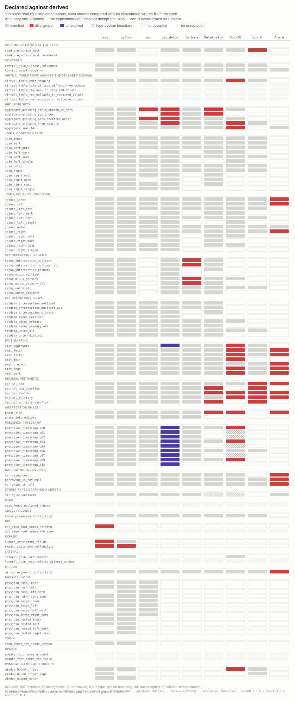
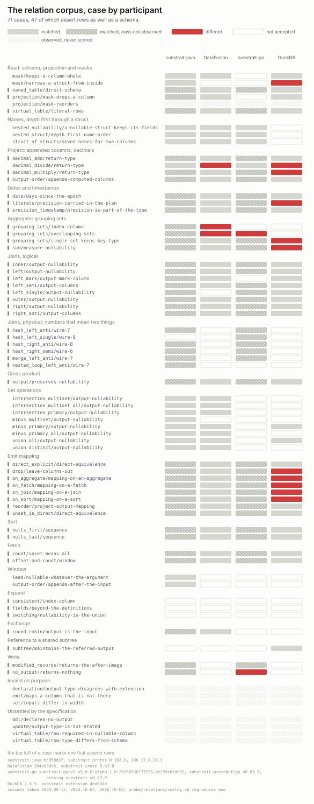

# Substrait conformance cases

[](https://github.com/alexandrefimov/substrait-conformance-cases/actions/workflows/selfcheck.yml)

Executable test cases for Substrait output schemas and relation semantics. They compare what the
specification says a plan should produce with what libraries and engines actually return, so a
disagreement can be traced to a rule, a plan and a pinned implementation build.

The repository contains two corpora authored against Substrait v0.102.0. Every expectation is
written from the specification text it cites, not captured from an implementation. This is an
independent investigation supporting the [relation conformance proposal](https://github.com/substrait-io/substrait/issues/1164),
not an official Substrait test suite or a certification of an implementation.

| Corpus | What it tests | Measured participants |
| --- | --- | --- |
| [`derived-schema/`](derived-schema) | 108 generated plans, where the type a plan declares and the type a consumer derives can disagree without either side raising it | substrait-java, substrait-python, substrait-go, substrait-validator, Isthmus/Calcite, DataFusion, DuckDB, Spark, Acero, Gluten |
| [`tests/relations/`](tests/relations) | 71 hand-written cases pinning what the relation documentation says a relation outputs, schema and rows alike | substrait-java, substrait-go, DuckDB, DataFusion |

[The matrix as a page](https://alexandrefimov.github.io/substrait-conformance-cases/) puts the
answer and the expectation beside each cell.

## Start with your question

| If you want to... | Start here |
| --- | --- |
| Review a specification rule or an expectation | [METHOD.md](METHOD.md#where-the-expectations-come-from) explains the source and limits of the expectations; [specification questions](FINDINGS.md#specification-questions) links the reports. |
| Check your library or engine | [Schema differences](results/DIFFS.md) lists cases by participant; the [relation matrix](https://alexandrefimov.github.io/substrait-conformance-cases/#relations) includes schema and row results. [Running it](#running-it) reproduces a saved column. |
| Check plans your producer writes from SQL | [Producer shapes](probe/producer-shapes/README.md) runs producers and passes their plans to consumers. These observations are separate from the corpus scores. |
| Reuse relation cases in your own harness | [Relation test vectors](tests/relations/README.md) describes the protobuf bundle contract, fixtures, expected schemas and rows. Reading a bundle needs no authoring parser. |
| Add a case or a participant | [Generators](gen/README.md) covers the schema corpus; [relation cases](tests/relations/README.md#writing-a-case) and [relation runners](probe/relations/README.md#adding-a-participant) cover the relation corpus. |

No build is needed to read the saved results. The [method](METHOD.md) explains what a match
establishes; [FINDINGS.md](FINDINGS.md) connects reproducers to upstream reports and proposed fixes.
An expectation can be wrong. If it does not follow from the specification text it cites, open an
issue here with the case name and the rule you read differently.

## Reading the results

The columns measure different consumer APIs and type systems at pinned versions. Their totals
are not a ranking of engines or a measure of overall Substrait support. A schema match does not
establish correct rows, function binding or independent return-type derivation. Cases without a
settled expectation are observed without being scored. The sections below show those limits.

Sixteen of the twenty-one reasons behind a divergence link an issue or a PR in the project it is
about: substrait, substrait-java, substrait-go, substrait-python, substrait-validator, DataFusion,
DuckDB's extension, Arrow. A linked fix does not change the saved answer; the column must be
retaken to measure it.

## Schema results

Take `decimal_divide`, `dec(10,2)` over `dec(5,1)`, where
`functions_arithmetic_decimal.yaml` gives `dec(21,8)`:

    substrait-java, substrait-go, substrait-python, validator, Isthmus, Gluten   dec(21,8)
    Spark        dec(17,8)
    DataFusion   dec(15,6)
    DuckDB       fp64
    Acero        dec(16,7)

The columns were taken 2026-09-18, 2026-10-02, 2026-10-05 against the versions in
[`probe/versions.env`](probe/versions.env); the weekly `drift` run reports what has moved since. When something moved, its artifact contains a proposed
`results/DRIFT.txt` change for a normal reviewed PR. They answer the 98 cases that carry an
expectation. The nine in the table are consumer paths rather than engines: the Java core, Isthmus
and Spark all go through substrait-java, and DuckDB through its substrait extension. Gluten, the
tenth, runs over the virtual-table variant in a cluster and is retaken separately.

<picture>
  <source media="(prefers-color-scheme: dark)" srcset="docs/matrix-dark.svg">
  
</picture>

Matched in grey, differed in red, a plan the implementation does not accept as an outline, a limit
of its type system hatched.

| | matched | differed | unsupported |
| --- | ---: | ---: | ---: |
| substrait-java | 92 | 3 | 3 |
| substrait-python | 95 | 1 | 2 |
| substrait-go | 69 | 2 | 27 |
| substrait-validator | 64 | 14 | 20 |
| Isthmus/Calcite | 57 | 4 | 37 |
| DataFusion | 59 | 7 | 32 |
| DuckDB | 36 | 21 | 41 |
| Spark | 31 | 6 | 61 |
| Acero | 4 | 16 | 78 |

**The first row is calibration, not a result.** Most plans are built with substrait-java builders,
by the person who also wrote the generators and the expectations, so its 92 matches say that two
encodings of a spec rule agree. [The two `expand` cells](METHOD.md#the-two-expand-cases) are where
even this row differs.

Four more rows carry a narrower version of the same caveat.
[The declaration swap](METHOD.md#what-a-match-establishes) puts a false `output_type` into every
plan that declares one, and five of the rows move with it: 16 of substrait-java's matches, 15 of
substrait-python's, 13 each of substrait-go's and Isthmus's and 12 of the validator's are the
declared type read back rather than a derivation. Only 29 of the 108 cases declare an output type,
and the swap reaches nothing else. Acero, DataFusion, DuckDB and Spark answer the swapped plan exactly as
they answer the original.

*Differed* means the answer disagrees
with this repository's reading of the spec, which is not the same as a defect:
`differed.json` carries a reason written by hand for all 74 of them, 16 marked as something other
than a divergence, and `probe/check_differed.py` tests every reason against the saved column. A
column is also compared only as far as its own type system reaches. DuckDB's logical types carry no
nullability, nor do Gluten's. Each column states its comparison limits in the header of
`results/<NAME>.txt`.

Which relations those 108 plans reach at all is counted in [METHOD.md](METHOD.md#what-the-corpus-covers), from the plans themselves.

## Relation results

<picture>
  <source media="(prefers-color-scheme: dark)" srcset="docs/relations-dark.svg">
  
</picture>

One story per column. substrait-java answers 58 of the 63 scored cases and refuses 5. substrait-go
refuses 21, eight of them the set operations, whose inputs it requires to agree on a nullability
these cases deliberately vary. DuckDB and DataFusion execute, so they are the two measured against
the rows that 47 of the cases assert. DuckDB's 11 divergences all show in the schema, five of them
in the rows as well, and so do DataFusion's 3, two of them in the rows: so far the rows have
confirmed an answer rather than caught one. Both reach the rows of 31 cases and return the same rows
on 26. The other five are the emit cases, where DataFusion returns the rows the case asserts and
DuckDB does not. The hatched cells are substrait-java and substrait-go agreeing about a schema and
never seeing the rows. Eight cases carry no expectation on purpose and are never scored.

`results/relations/` holds one column per participant, and `bash probe/relations/replay.sh <NAME>`
rebuilds one participant from nothing at its pinned version.
[`probe/relations/README.md`](probe/relations/README.md) is how the measurement works and how to add
a fifth.

## What would help

- **A second reading of the expectations, by someone with no stake in them.** They have been read
  once, from inside this repository: one contradicted the specification and was fixed, and
  [sixteen rest on a step the specification never states](https://github.com/alexandrefimov/substrait-conformance-cases/issues/8),
  thirteen of them joins. An answer on those sixteen is worth more than a fresh pass over the rest,
  and a wrong expectation is reported as a divergence against an implementation that was right.
- **From the spec, one answer.** What does a projection mask listed out of schema order yield? The
  spec says a mask can "only mask things out", yet DuckDB's substrait extension writes a mask of
  `[2, 0]` for `SELECT c2, c0`, and every participant here that applies the mask puts the columns in
  the listed order; one case waits on that.

## Running it

From the repository root:

```sh
bash probe/selfcheck.sh                    # local consistency checks; python3, no network
bash probe/replay_column.sh DUCKDB          # reproduce DuckDB's schema column
bash probe/relations/replay.sh DUCKDB       # reproduce DuckDB's relation column
```

Replace `DUCKDB` with `PYTHON`, `GO`, `ACERO`, `VALIDATOR`, `JAVA`, `ISTHMUS`, `SPARK` or
`DATAFUSION` for the schema corpus. The relation replay supports `DUCKDB`, `GO`, `JAVA` and
`DATAFUSION`. Each replay downloads and builds one participant at its pinned version, then
requires the saved answers back. Gluten is outside these replay commands.

The self-check compares committed artifacts with their sources; it executes no participant and
does not validate the specification reading. [`probe/README.md`](probe/README.md) has the build
prerequisites and failure conditions; [`probe/relations/README.md`](probe/relations/README.md)
has the relation setup and commands for intentionally retaking columns.

## What is here

| | |
| --- | --- |
| `derived-schema/` | the 108 plans, protobuf-JSON and binary, beside a `manifest.json` saying per case what it pins, the schema expected of it and the spec rule that expectation comes from. Read that rather than the plan |
| `derived-schema-virtual-tables/` | the same cases carrying their own rows |
| `results/<NAME>.txt` | one column per implementation; `probe/matrix.py`, `probe/diffs.py` and `probe/heatmap.py` draw `results/MATRIX.txt`, `results/DIFFS.md` and the pictures out of them |
| `expected.json` | the expectations, written by `probe/expected.py` |
| `differed.json` | a reason per differing cell |
| `deriver/` | the same rules read a second time: an output schema computed from the plan and the spec text, by rules written separately from `probe/expected.py` and compared with it. [`deriver/README.md`](deriver/README.md) says what that establishes |

Everything keys on a case's file name, and nothing generated is edited by hand.

The generated schema corpus needs a JDK and a substrait-java checkout to add a plan. The
relation corpus is authored separately and compiles to protobuf test bundles; its
[authoring guide](tests/relations/README.md) covers setup and checks. Neither corpus takes an
implementation's answer as its expectation.
